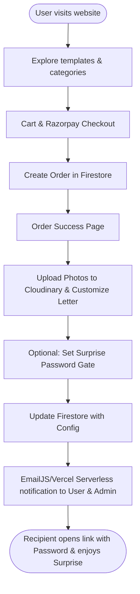

# 🎀 Pookie Wishes — Premium Digital Surprises 🎀

Catch their heart with a personalized digital journey. **Pookie Wishes** is an all-in-one ecosystem for creating, selling, and delivering interactive, high-end surprise websites for birthdays, proposals, anniversaries, games, and more.

[](https://pookie-wishes.vercel.app)
[](https://github.com)
[](https://firebase.google.com/)

---

## 🌟 Key Features

*   **Premium Interactive Templates**: 11 unique vibes (Hello Kitty, Harry Potter, Celestial Universe, Among Us, Anniversary Journey, HipHop, Ninja Game, and more) packed with interactive mini-games, dynamic scroll animations, music players, and scratch-offs.
*   **Zero-Touch Automation**: Fully automated flow from Razorpay checkout -> customer personalization -> automated delivery emails.
*   **Surprise Password Protection 🔓**: Allows senders to optionally secure their surprise link with a beautiful gift-box password gate.
*   **Cloudinary Photo engine**: Automatic, secure client-side uploads of customer-supplied images into customizable interactive slots.
*   **Admin Command Center**: A comprehensive command console to view orders, trigger manual/automatic confirmation emails, send marketing broadcasts, delete expired assets, and manage customer feature requests.

---

## 📐 System Flow & Architecture



---

## 📁 Repository Directory Tour

Here is a map of the Pookie Wishes codebase to help you navigate:

```text
├── admin/
│   └── index.html                 # Admin Command Center UI (Analytics, Orders, Broadcasts)
├── api/
│   ├── delete-media.py            # Serverless function to prune old images on Cloudinary
│   ├── razorpay-order.py          # Serverless payment gateway initiator
│   ├── requirements.txt           # Python dependency declarations for serverless functions
│   └── send-email.js              # Serverless nodemailer trigger for mail marketing broadcasts
├── assets/                        # Shared image and icon assets
├── css/
│   ├── style.css                  # Core application stylesheet (themes, layout, animations)
│   └── password-gate.css          # Styled password gate overlay for locked surprises
├── data/
│   ├── site.json                  # Dynamic template registry, pricing database, and keys
│   └── email-content.json         # Marketing/operational newsletter mail templates
├── js/
│   ├── app.js                     # Core application client-side scripts
│   ├── theme.js                   # Handles light/dark system settings and cookies
│   ├── template-loader.js         # Core router that renders and configures individual template pages
│   └── dashboard.js               # Customer order/favorites database panel handler
├── pages/                         # Core web app routing pages
│   ├── checkout.html              # Razorpay checkout & processing UI
│   ├── dashboard.html             # User tracking dashboard
│   ├── favorites.html             # Saved user favorites
│   └── order-success.html         # Post-purchase personalization portal
├── templates/                     # Individual custom surprise directories
│   ├── hello-kitty-template/      # Kawaii birthday surprise with cake cutting
│   ├── harry-potter-template/     # Wizarding story panels, sort quiz, owl letter
│   ├── celestial-template/        # Cosmic galaxy star tracer & music orbits
│   ├── among-us-template/         # Character tasks, emergency meeting, space ejection
│   ├── anniversary-journey-template/# Horizontal scroll timeline with memory frames
│   ├── ninja-game-template/       # Retro platformer arcade collection game
│   └── (others...)                # sorry-template, wedding-template, hiphop-template
└── tools/                         # Operational helper scripts
```

---

## 🎭 Templates Index

Pookie Wishes features highly specialized templates configured in `data/site.json`:

| Template ID | Vibe | Price | Core Interactive Elements |
| :--- | :--- | :--- | :--- |
| **`hello-kitty`** | Romantic & Cute | ₹69 | Interactive cake-cutting, candle blow & wish, memory match card game. |
| **`harry-potter`** | Magical & Epic | ₹69 | Sideways scrolling story panels, Wizard Word Hunt, Sorting Hat quiz, Owl letter. |
| **`love-trap`** | Romantic & Playful | ₹39 | Romantic confession layouts, interactive love trap game, countdowns. |
| **`celestial`** | Cosmic & Immersive | ₹29 | Star Tracing game, 🪐 3D rotating planets, typewriter reveal, background music. |
| **`among-us`** | Funny & Gaming | ₹79 | Sus character animations, interactive tasks, emergency meeting reveal, space ejection. |
| **`anniversary-journey`**| Emotional & Journey| ₹39 | Scroll-based memory timeline, dynamic photo frames, cinematic letter exit. |
| **`ninja-game`** | Action & Nostalgic | ₹79 | Retro 8-bit platforming game, scroll coin collections, secret parchment letter. |
| **`wedding`** | Majestic & Royal | ₹39 | Floral entrance, interactive Love Lock lockbox, customized scrapbook layout. |
| **`sorry`** | Emotional & Sweet | ₹39 | Personal photo frames, soft soundtrack, redeemable custom "Pookie Voucher". |
| **`hiphop`** | Urban & Glitch | ₹69 | Neon aesthetics, simulated chat transcripts, glitch interactions, locked letter. |

---

## 🛠️ Service Integration & Setup

Pookie Wishes links standard cloud services together. Follow this guide to set them up:

### 1️⃣ Firebase configuration
Create a new project on the [Firebase Console](https://console.firebase.google.com/). Add a web application, and paste the config snippet into your `.env` file or directly into `data/site.json` under `"firebase"`:
```json
"firebase": {
  "apiKey": "YOUR_API_KEY",
  "authDomain": "YOUR_PROJECT_ID.firebaseapp.com",
  "projectId": "YOUR_PROJECT_ID",
  "storageBucket": "YOUR_PROJECT_ID.appspot.com",
  "messagingSenderId": "YOUR_SENDER_ID",
  "appId": "YOUR_APP_ID"
}
```

#### 🔒 Firestore Security Rules
Ensure the database has security settings preventing unauthorized read/delete calls to orders:
```javascript
rules_version = '2';
service cloud.firestore {
  match /databases/{database}/documents {
    match /orders/{orderId} {
      allow create, update: if true;
      allow read, delete: if request.auth != null && 
        request.auth.token.email in ['admin-email@gmail.com'];
    }
    match /counters/{doc} {
      allow read, write: if true;
    }
    match /suggestions/{doc} {
      allow create, read, write: if true;
    }
  }
}
```

### 2️⃣ Razorpay Credentials
For accepting payments, generate API credentials inside your Razorpay Dashboard, and configure them as environment variables:
*   `RAZORPAY_KEY_ID`
*   `RAZORPAY_KEY_SECRET`

### 3️⃣ EmailJS Automation
Set up an account with [EmailJS](https://www.emailjs.com/). Update the variables in `data/site.json` to route user verification emails instantly:
*   Create a **Delivery Template** (sends personalized interactive links).
*   Create an **Admin Template** (notifies the admin of customized configurations).

### 4️⃣ Cloudinary Image Preset
Sign up on [Cloudinary](https://cloudinary.com/) for media hosting:
*   Go to **Settings** -> **Upload Presets**.
*   Create an **Unsigned Preset** named `pookie_unsigned`.
*   Set the delivery folder destination to `orders` to hold custom images.

---

## 💻 Local Development Setup

To run Pookie Wishes locally:

1.  **Clone the Repository** and navigate to the directory:
    ```bash
    git clone https://github.com/nikhilrawat2005/Pookie-Wishes.git
    cd pookie-v3
    ```

2.  **Install dependencies** (required for Vercel Serverless Functions):
    ```bash
    npm install
    ```

3.  **Run Serverless / Frontend preview**:
    *   Using Node `serve`:
        ```bash
        npx serve .
        ```
    *   Using Vercel CLI (recommended for testing API routes):
        ```bash
        vercel dev
        ```

4.  **Edit configurations**: All pricing adjustments, payment configurations, templates, or submission forms are managed centrally in `data/site.json`.

---

## 📬 Contact & Support

*   **Maintainer**: Team Cipher
*   **Instagram**: [@pookiewishes](https://www.instagram.com/pookiewishes/)
*   **Email Support**: [teamcipher.work@gmail.com](mailto:teamcipher.work@gmail.com)

> "Don't just wish it. Pookie Wish it." 🎀
